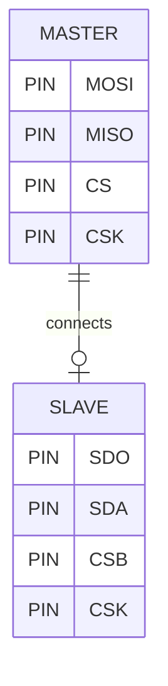

# mCU-project

**This project is the final project of the class of mCU Programming and Communication Protocols.**

# Overview

The following project is a display of the MS5611 high resolution and high speed temperature/pressure sensor, this sensor is used on low power small devices such as smartwatches, phones, etc.

The project is straightforward it just consists of:
- Hitachi LCD 16x2
- MS5611 Sensor
- STM32 F429ZI Nucleo Board

# MS5611 SPI

The sensor is quite interesting as it is capable of running in I2C and SPI modes, this project uses SPI to interact with the sensor this comes with the benefit of higher transmit speeds due to SPI's higher transfer rates. To enable SPI mode the following connection must be performed : 

# FSM

Three FSMs were implemented one to control the user button, this controls another FSM to control the display menu, and finally a power FSM to set the peripherals into low-power mode, meaning stops communicating with the sensor, and the LCD gets turnt off. 

